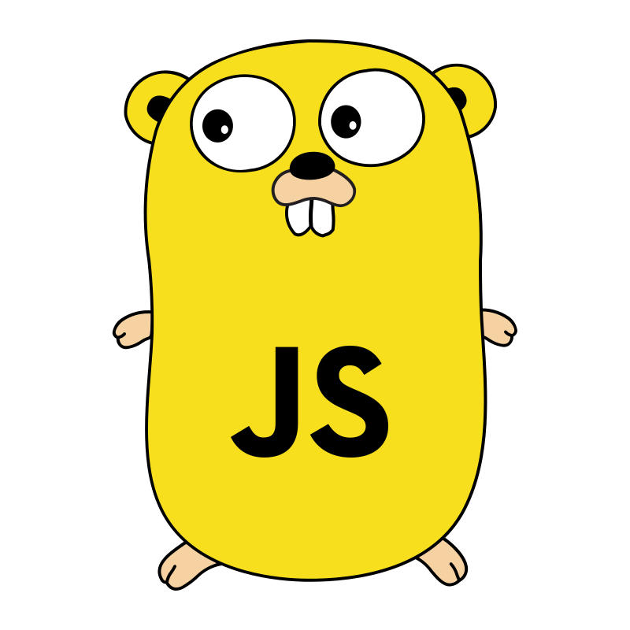

# GopheRPC

GopheRPC is a RPC library that lets you call Go server functions from your JavaScript (browser) clients without any additional dependencies or code generation.

Server functions can be added on runtime (even after the client has connected to the server) and can return any value or error that is JSON serializable.  
Return values on client side are wrapped in a `Promise`.



```go
package main

import (
	"context"
	"net/http"

	"github.com/tsukinoko-kun/gopherpc"
)

func main() {
	gopherpc.Register("foo", func(ctx context.Context, args []any) (any, error) {
		return "bar", nil
	})

	// Use HandleFunc, Handle or Get depending on the mux you are using.
	// Tested with net/http and chi router.
	gopherpc.HandleFunc(http.DefaultServeMux)

	http.HandleFunc("/", func(w http.ResponseWriter, r *http.Request) {
		w.Header().Set("Content-Type", "text/html")
		w.Write([]byte(`<!DOCTYPE html>
			<html>
				<head>
					<title>GopherPC</title>
				</head>
				<body>` +
					gopherpc.ImportJs() + // script tag that imports the gopherpc.js runtime
					`<button onclick="gopherpc.foo().then(alert)">Call foo</button>
				</body>
			</html>`))
	})

	if err := http.ListenAndServe(":8080", nil); err != nil {
		panic(err)
	}
}
```
